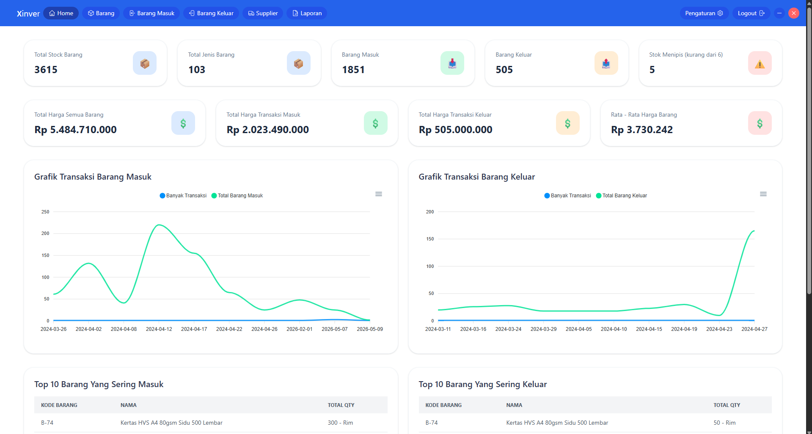
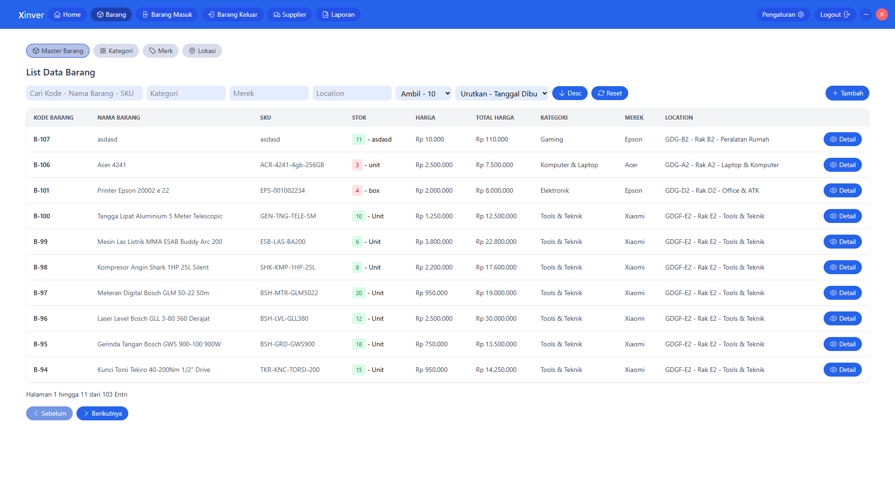
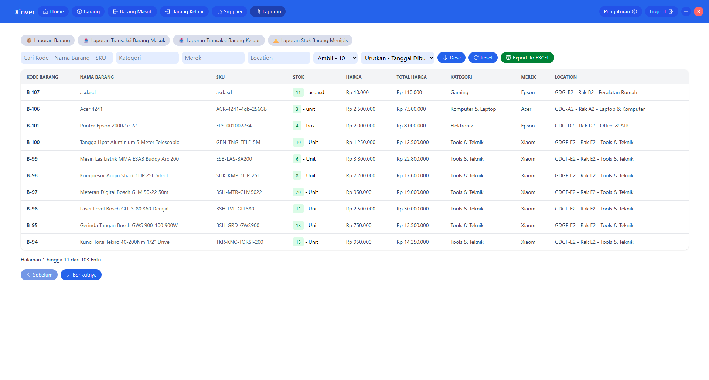

## Xinver Simple Inventory System

xinver Simple Inventory System adalah aplikasi untuk mengelola stok barang secara sederhana. Aplikasi ini membantu mencatat barang masuk, barang keluar, dan memantau jumlah stok dengan mudah. Dirancang dengan tampilan yang ringan dan mudah digunakan, aplikasi ini cocok untuk kebutuhan usaha kecil hingga menengah.

### Fitur

- Dashboard inventory
- Manajemen data barang
- Kategori barang
- Supplier
- Transaksi barang masuk
- Transaksi barang keluar
- Monitoring stok barang
- Stok menipis
- Pencarian data barang
- Riwayat transaksi
- Laporan inventory
- Export laporan Ke Excel
- Database SQLite offline
- Tampilan sederhana dan responsif
- Desktop application berbasis Tauri
- Bisa menjalankan aplikasi secara offline
- Detail gambar barang pada data detail barang

#### Gambar Dashboard

#### Gambar Kelola Barang

#### Gambar Kelola Laporan

#### Tauri + Vue 3

This template should help get you started developing with Tauri + Vue 3 in Vite. The template uses Vue 3 `<script setup>` SFCs, check out the [script setup docs](https://v3.vuejs.org/api/sfc-script-setup.html#sfc-script-setup) to learn more.
